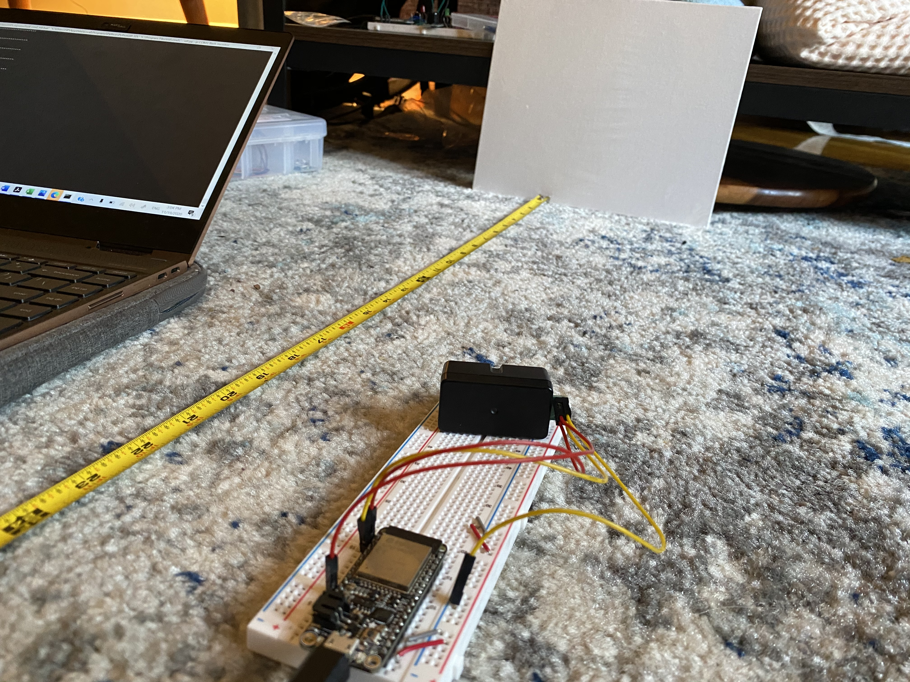
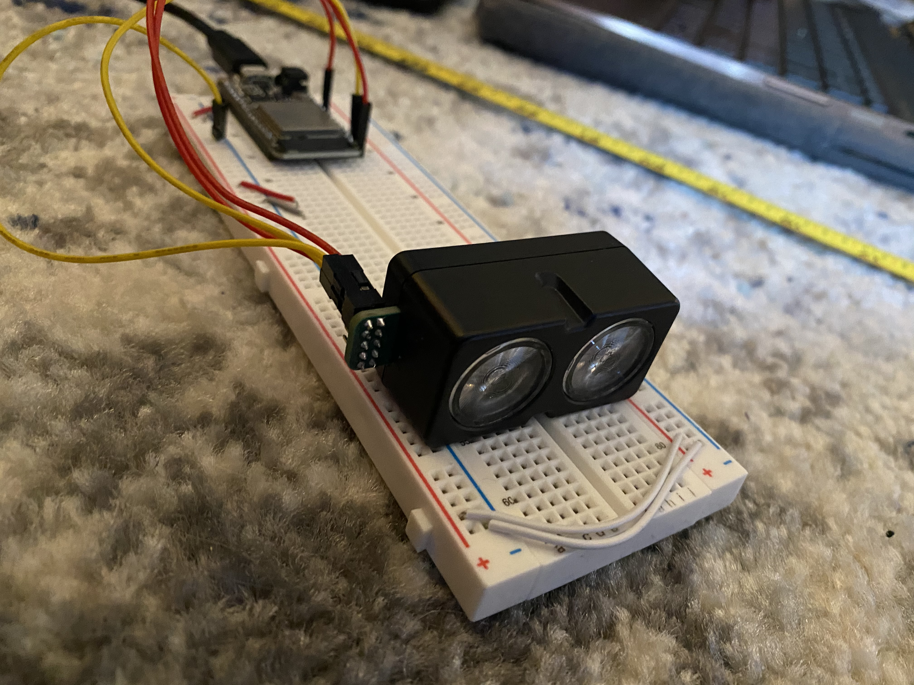

#  Skill 31

Author: John Kircher

Date: 2020-11-16
-----

## Summary
For this skill we wired up the Garmin v4 LIDAR sensor using the operational manual as reference. After initializing the sensor as an I2C device and referencing its slave address, we created read and write register functions in order to interact with sensor data. We then created a function called lidarRead(), which repeatedly pulls data when the LSB of register 0x01 goes to 0, and converts it into centimeters to be displayed in the terminal. More information on how this is implemented in the code can be found in the code README inside the code folder.

## Sketches and Photos

## Video
[Click Here](https://drive.google.com/file/d/1d47KrUaVpXFZc5M2mXnCssK2H-uaYe1T/view?usp=sharing)

## Modules, Tools, Source Used Including Attribution
Garmin v4 LIDAR Sensor Operation Manual:
http://static.garmin.com/pumac/LIDAR-Lite%20LED%20v4%20Instructions_EN-US.pdf

## Supporting Artifacts

-----
