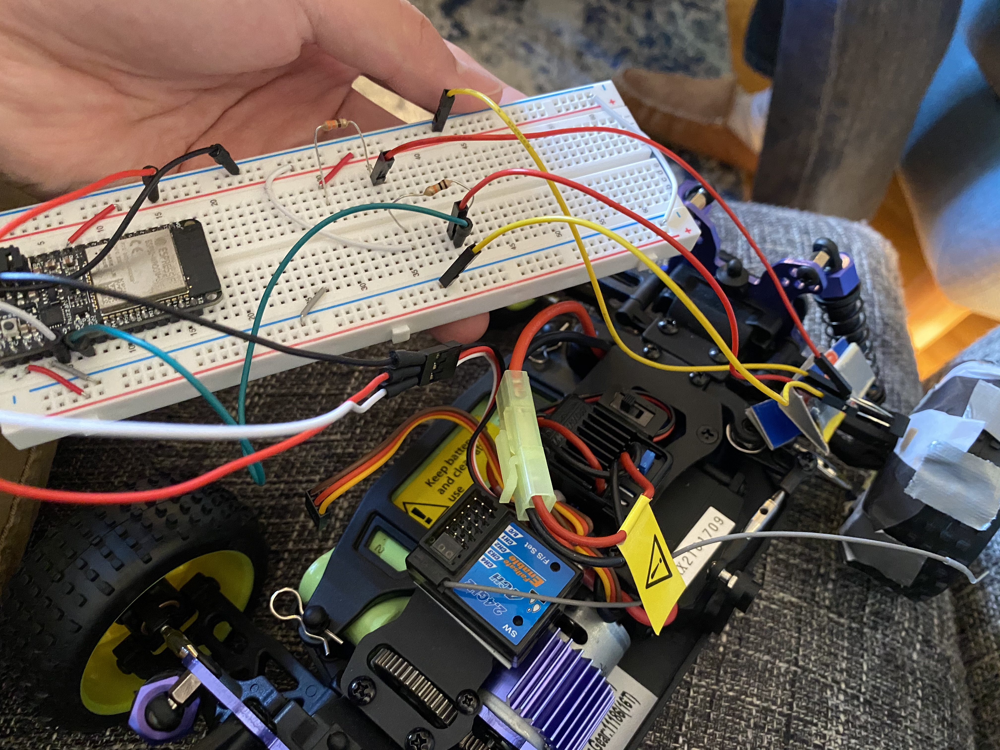
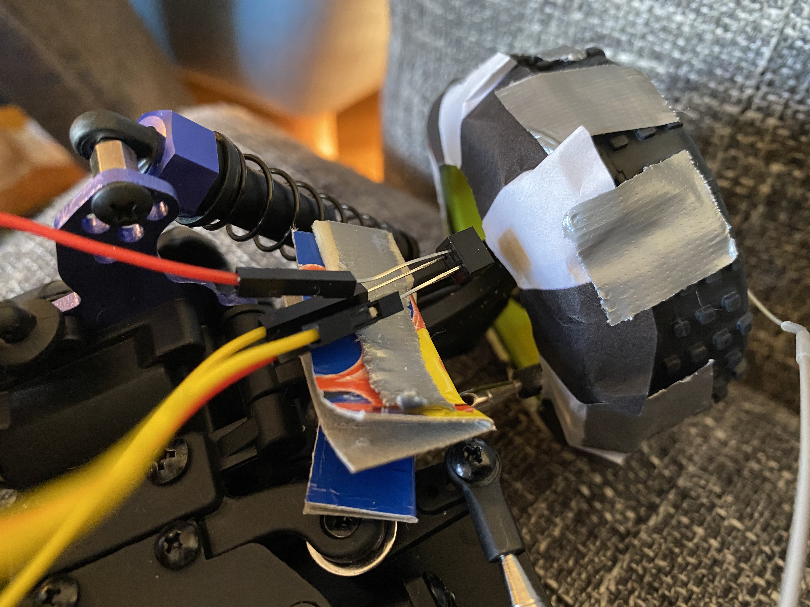
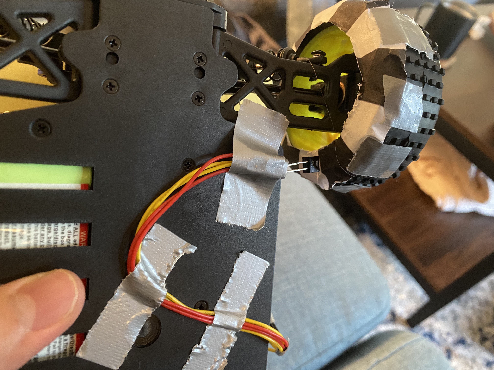

#  Skill 32

Author: John Kircher

Date: 2020-11-16
-----

## Summary
For this skill, we printed out the encoder pattern, cut it down to size, and attached to the inside of one of the crawler wheels. Next, we attached the optical decoder to the crawler chassis and configured it to count the pulses for unit time in order to calculate wheel speed in meters per second. This involved configuring the optical decoder as an ADC device. More information on how this was implemented in the code can be found in the code README inside the code folder.

## Sketches and Photos

## Video
[Click Here](https://drive.google.com/file/d/1Et-weQcvrTZ35WkH441q0HCYs0NZVelF/view?usp=sharing)

## Modules, Tools, Source Used Including Attribution
Sparkfun Guide to Optical Encoder:
https://learn.sparkfun.com/tutorials/qrd1114-optical-detector-hookup-guide#example-circuit

## Supporting Artifacts

-----
