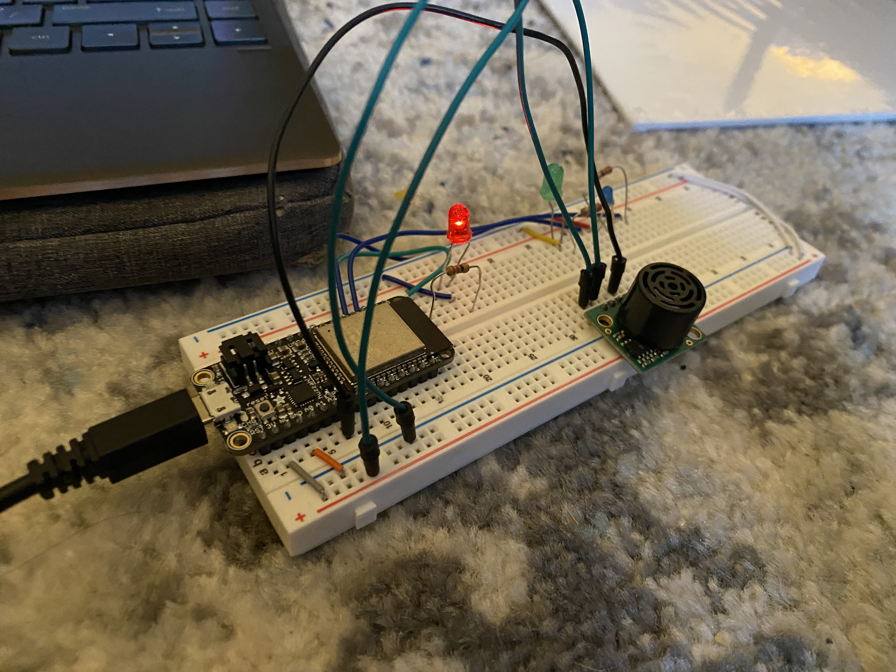

#  Skill 33

Author: John Kircher

Date: 2020-11-16
-----

## Summary
For this skill, I created a PID loop with only proportional control. I wired up 4 LEDs as shown  on the class site and used the ultrasonic sensor to get a range. Using the PID design pattern, I then impelmented a timing loop with a 100ms period to calculate the error on each cycle. 

## Sketches and Photos

## Video
[Click Here](https://drive.google.com/file/d/15Ubg3dZlc-_0RS0pxivhIzcBohRLsfcG/preview)

## Modules, Tools, Source Used Including Attribution

## Supporting Artifacts

-----
